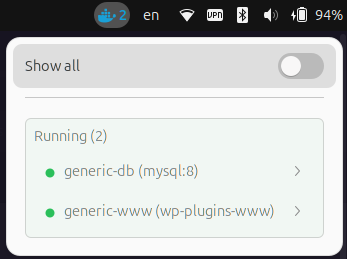
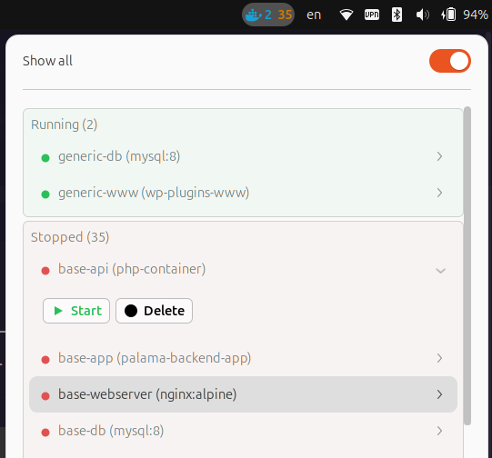
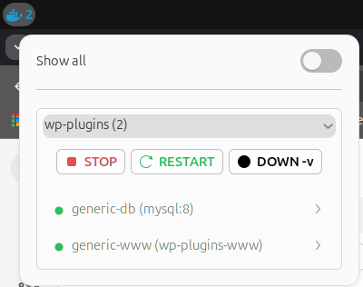

# Docker Manager (GNOME Shell Extension)

GNOME Shell extension that uses the Docker API via the Unix socket to manage Docker containers.

## Features

- The top bar shows a blue Docker icon with a number indicating running containers
- Left click: popup with the list of running containers
  - A toggle in the popup shows stopped containers as well
  - Each item represents a container that can be started, stopped, restarted, or deleted
- Right click: menu with a **Settings** entry

## Screenshot




## Installation

1. Clone or copy the extension folder to:
   `~/.local/share/gnome-shell/extensions/docker-manager@sydro.github.com`
2. Compile the GSettings schema:
   ```bash
   glib-compile-schemas ~/.local/share/gnome-shell/extensions/docker-manager@sydro.github.com/schemas
   ```
3. Enable the extension:
   ```bash
   gnome-extensions enable docker-manager@sydro.github.com
   ```
4. If needed, restart GNOME Shell (Alt+F2, then `r`) or log out/log in (Wayland).

## Development

If you’re working in the repository, you can use a symlink to the GNOME Shell directory:

```bash
ln -sfn "$(pwd)" ~/.local/share/gnome-shell/extensions/docker-manager@sydro.github.com
```
